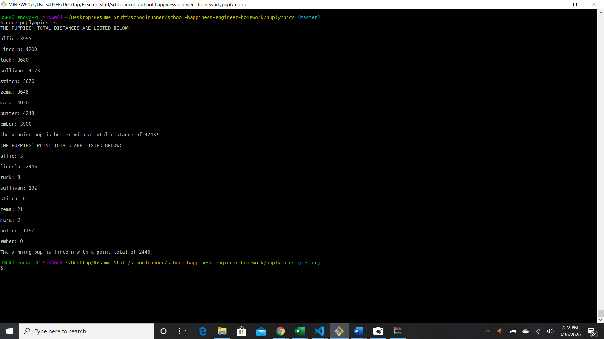

# puplympics

In this CLI app, the user can discover which puppy wins the race using two methods: 

* Total distance: The puppies only have two states (running and resting). They run a certain number of feet per second for a specified number of seconds. Upon completion, they begin their rest period. This cycle continues until the race ends.

* Total points: At the end of each second the puppy that is currently in the lead is awarded 1 point. If multiple puppies are tied for the lead, each puppy would get one point.

To change the length of the race, enter the number of seconds as the value of the `raceLength` variable.

To run the race, the user must enter: `node puplympics.js`. They will see the total distance of all puppies plus the name and total distance of the winner. They will also see the point total for all puppies along with the name and point total of the winner.

 

### Technologies
Javascript, node.js

### Created by Amber Moreyra